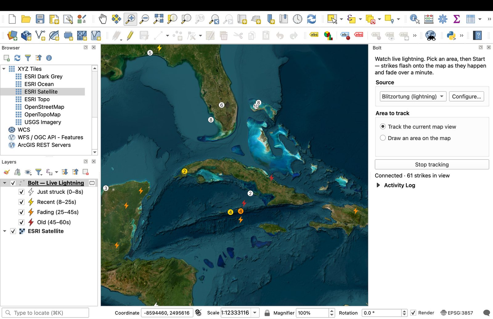

# Bolt

Watch **live lightning detections** on your map. Bolt streams real-time
**detections from the Blitzortung.org volunteer sensor network** into QGIS and
shows them flash onto the map as they happen, then fade over a minute — track
your current map view, or draw an area to watch. Live only; no history replay.

Bolt is one of four sibling plugins built on the same live-tracking engine — a
pluggable data-source layer, a moving/expiring-point map layer, clustering and
identify — covering **sea, sky, space and storms**:

- [Wake](https://github.com/PeterCotroneo/Wake) — marine vessels (AIS)
- [Contrail](https://github.com/PeterCotroneo/Contrail) — aircraft (ADS-B)
- [Zenith](https://github.com/PeterCotroneo/Zenith) — satellites (SGP4)
- **Bolt** — lightning (this one)

## Features

- **Live detections** — lightning **detections** from the Blitzortung sensor network appear as they are reported, in near real time.
- **Free and keyless** — no account, no API key.
- **Age-coloured** — each detection flashes bright, then fades white → yellow → orange → red over about a minute, so the map shows where storms are active *right now*.
- **Cluster badges** — busy storm cells collapse into a counted marker, coloured by the freshest detection; zoom in and they fan out.
- **Coverage-aware** — these are *detections*, not ground truth. An area with no markers may mean **no lightning** *or* **no sensor coverage** there. Coverage is best where operators are dense (Europe, North America, Japan, Australia) and thinner elsewhere.
- **Click for detail** — Identify any detection for its time (UTC) and how many detectors reported it.
- **Area-based** — watch your map view or a drawn box; detections outside it are dropped.
- **No extra dependencies** — uses Qt's built-in WebSocket, so it installs cleanly.

## Data source, attribution and terms

Detections come from the **[Blitzortung.org](https://www.blitzortung.org/)**
volunteer network — a community of operators running receivers around the world.
Bolt keeps the attribution visible in its panel.

**Please read Blitzortung's terms before relying on or sharing this data.**
Blitzortung's raw data is intended for **project participants** (station
operators) and for **private, non-commercial** use; redistribution to third
parties is restricted without their explicit permission. Bolt is non-commercial
and keeps attribution visible, but it is your responsibility to use the feed
within Blitzortung's terms. This is volunteer-run infrastructure — please respect
the community.

## Install

1. Download this repository as a ZIP (or clone it).
2. In QGIS: **Plugins → Manage and Install Plugins → Install from ZIP**, and select the zipped `bolt/` folder, or copy `bolt/` into your QGIS plugins directory.
3. Enable **Bolt**. A **Bolt** panel appears on the right.

## Usage

1. Choose the **Source** (Blitzortung — keyless, no configuration).
2. Choose **Track the current map view** or **Draw an area on the map**.
3. Click **Start tracking**. Strikes flash onto the map in real time and fade over a minute. Pan to an active storm to watch it light up.

## Credits

Lightning data © [Blitzortung.org](https://www.blitzortung.org/) and its
contributors, used under their non-commercial terms.

## License

GPL-2.0-or-later.
